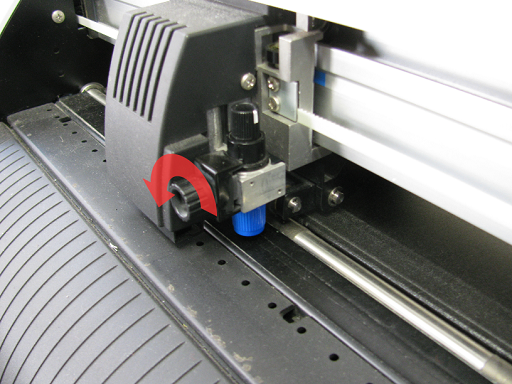
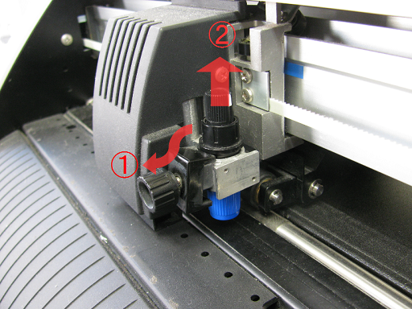
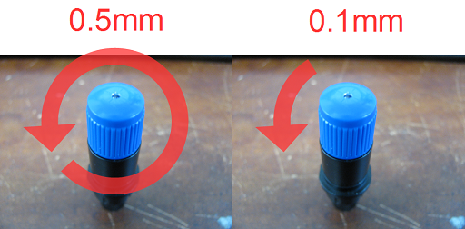
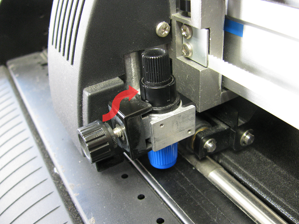

# 02.カッター刃のセットアップ
  

 
 

カッター刃手前の**ホルダ固定ねじ**を反時計回り、左に回して緩めます。 
 
 
 

 
 

**ホルダ押さえ**をつまんで手前に傾け（①）、 
カッター刃の調整つまみをつかんでカッター刃を上に引き抜きます（②）。 
 
 
 

 
 

カッター刃の**調整つまみの青い部分**を左右に回して刃出し量を調整します。 

* 刃を上にして、反時計回りに1メモリ分回すと約0.1ミリ、1回転で約0.5ミリ刃が出ます。
* 加工素材の厚さを超えるように、刃出し量を調節してください。
* 後述のテストカットによるカット圧とあわせて調整し、 
カット圧が最大でもうまく切り抜けない場合には、刃出し量を再度調整する必要があります。

 
 
 

 
 

刃出し量の調整が終わったら、カッター刃を再度ペンホルダに戻します。 
ホルダ押さえを手前に傾け、カッター刃ホルダのつばがホルダ押さえの下に入るようにします。 
ホルダ固定ねじを時計回り、右に回してしっかり締めます。 
 
 
 
 
 
 
