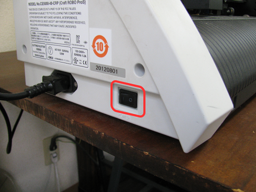
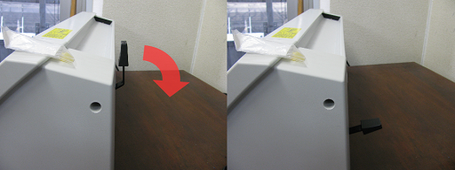
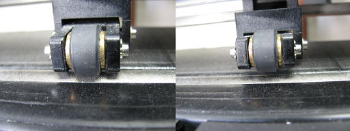
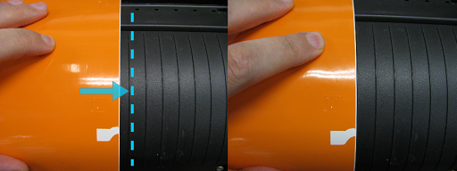
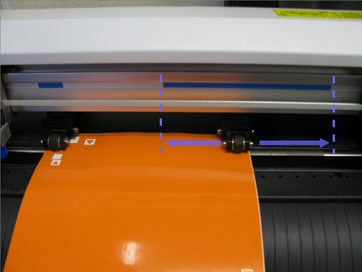
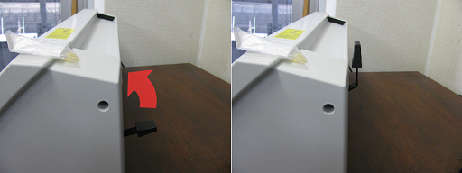
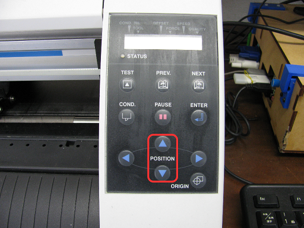
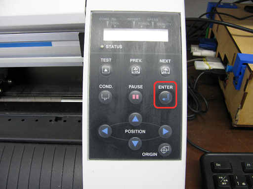
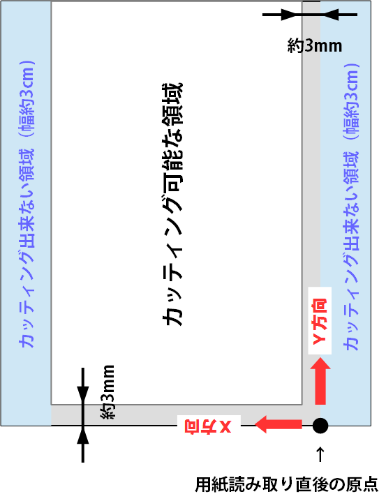
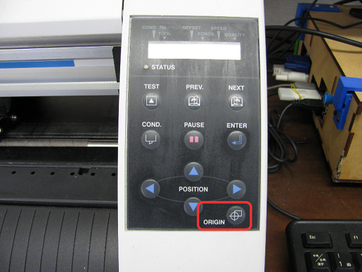

# 03.加工素材のセット
  

## 03-1.素材の取り付けとサイズ読み込み
 

 
 

CraftROBO本体左側面の電源スイッチを入れる。 
 
 
 

 
 

本体後方の**セットレバー**を下げます。 
 
 
 

 
 

そうすると、本体前面の用紙押さえの**プッシュローラー**が上がり、 
本体液晶に「ヨウシヲ　セットシテクダサイ！」と表示されます。 
 
 
 

 
 

加工する用紙の端を、本体前面のガイドライン（溝）に沿わせます。 
（このとき、必要に応じて加工素材を粘着台紙シートに予め固定しておきます。） 
 
 
 

 
 

**プッシュローラー**を左右に動かして用紙の幅に合わせます。 
このとき、**プッシュローラー**は本体上部、**青色のプッシュローラー位置ガイドマーク**の下にないと 
正常に用紙送りが行われません。そのため、一番右のプッシュローラの調整して用紙の幅と合わせる必要があります。 
 
 
 

 
 

**プッシュローラー**の位置が決まったら、用紙の端を本体前面のガイドライン（溝）に再度沿わせます。 
 
 
 

 
 

本体後ろの**セットレバー**を引き上げて用紙を固定します。 
 
 
 

 
 

本体液晶の表示が「シート」「ロール1」「ロール2」のいずれかに変わったら、 
本体右の**「POSITION」ボタン**の上下を押して、加工したい素材に合った表示に切り替えます。 

* **シート：** シート状の加工素材。通常はこちらを選択します。
* **ロール１、ロール２：** ロール状の加工素材。長尺のカッティングシート等を使う場合に選択します。 
給紙を本体の前面背面どちらで行うかで番号が異なるので、詳しくは取扱説明書を確認すること。 
 
 
 

 
 

**「ENTER」ボタン**を押して、マシンに用紙サイズの自動読み取りを行わせます。 

* 読み取り動作が終了すると、読み取った用紙サイズが**一瞬だけ**表示されるので、 
加工素材のサイズと一致するかどうかをすばやく確認する必要があります。 
ただし、読み取りサイズは後項目の「設定と加工：加工データの確認」でも表示できるのであわてないこと。
* 粘着台紙シートを使用している場合には、シートのサイズが表示される（読み込まれる）ので注意。
 
 
 

## 03-2.加工原点の設定
 

 
 

**「POSITION」ボタン** を押すことで、カッター刃の付いた**ヘッド**を移動させることができます。 

* このとき、ペンホルダの調整つまみの部分を指で軽く押すことでカッター刃を下げ、 
加工素材に刃を当てることで位置を確認してもOKです。（カッター刃が痛まないように軽く押さえること。）
* プッシュローラーの真下にあたる部分は加工できない余白になるので注意。 
（ローラーを経由して加工素材を前後に動かすため。）

 
 
 

 
 

カッティング可能な領域は上記の通りです。 
用紙読み取り直後の加工原点そのままだと、その0座標(X=0ないしはY=0)に沿った図形を 
うまく切り抜けない場合があるため、少なくともX・Yともに約3mm程度、＋側に移動するのがおすすめです。 
 
 
 

 
 

ヘッドの移動が完了したら**「ORIGIN」ボタン**を押して加工原点を変更・設定します。 
 
 
 
 
 
 
