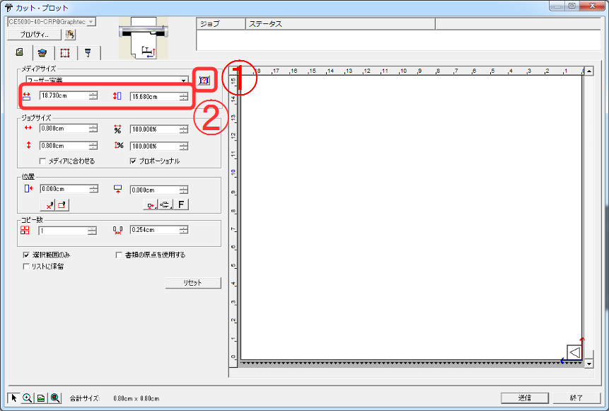
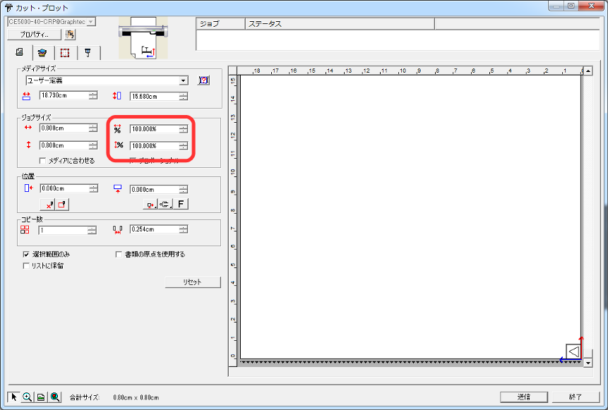
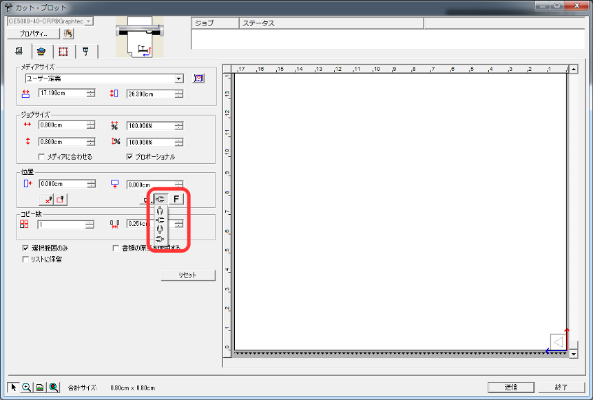
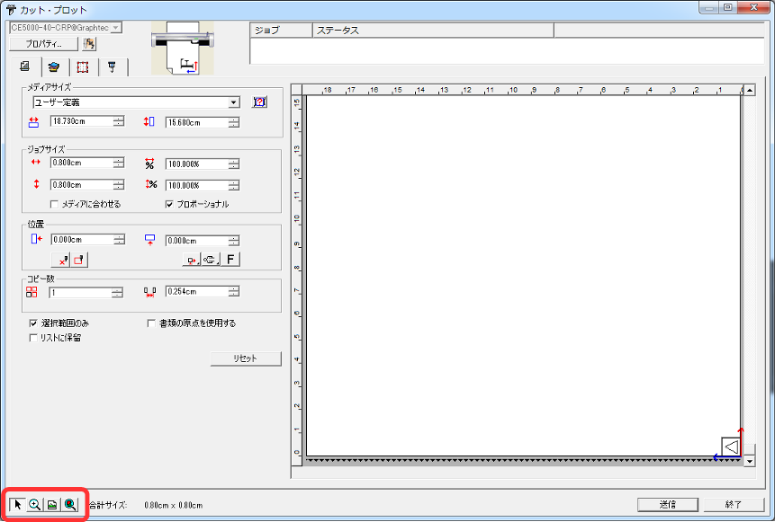
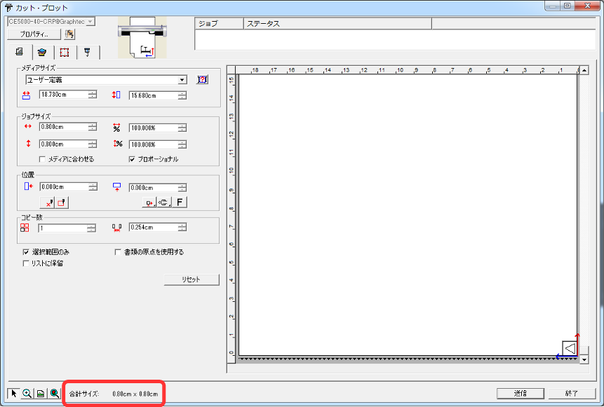
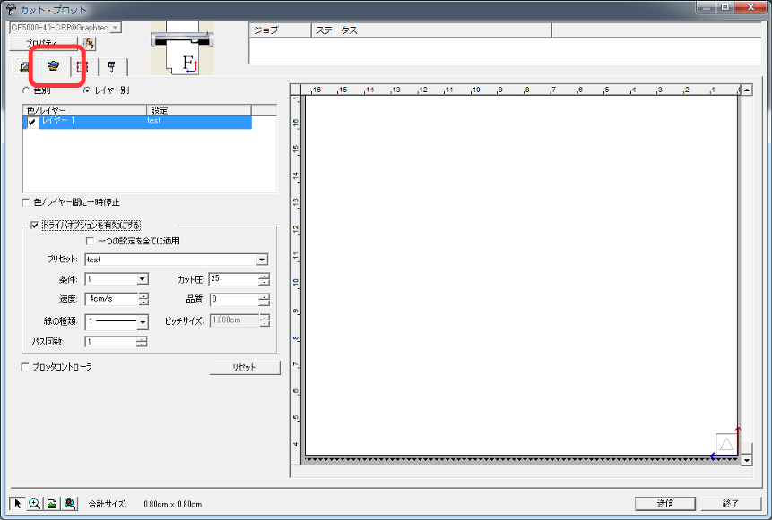
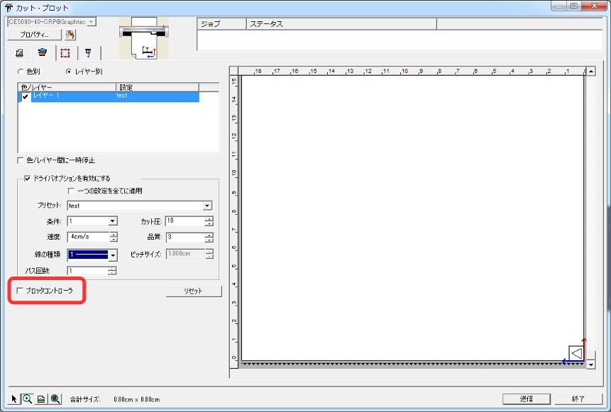
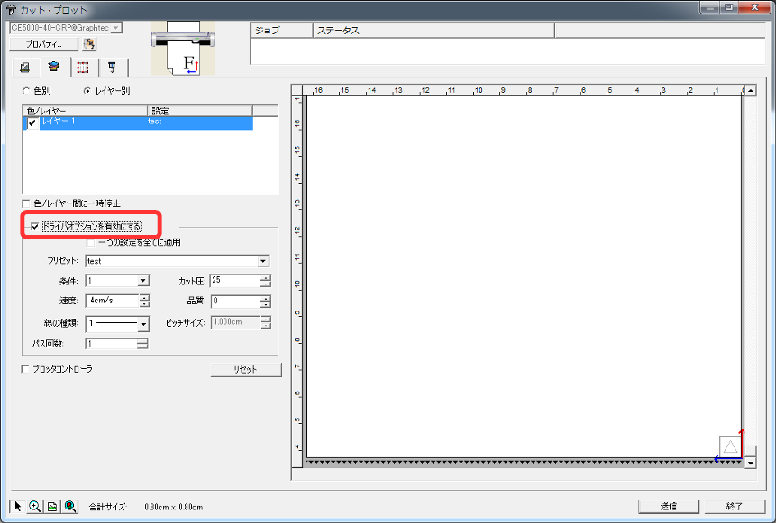
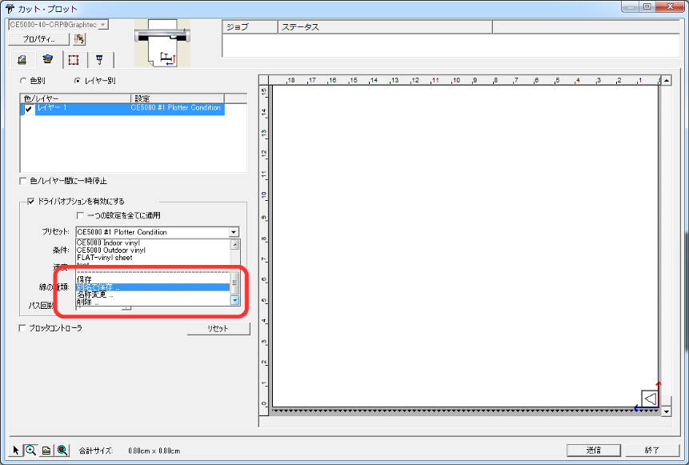
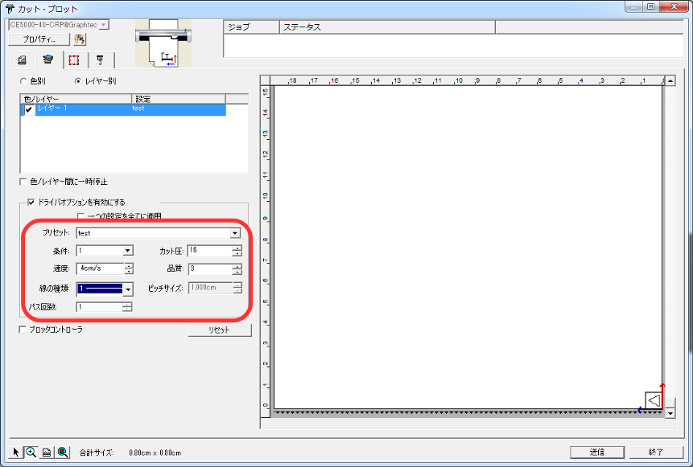

# 04.データの設定〜加工開始
  

## 04-1.加工データの指定
 

Adobe Illustrator上で加工したい図形を選択し、 
メニューの**ファイル** ＞ **Cutting Master2** ＞ **カット・プロット**を選択し、 
カッティングプロッタ用ソフトウェア**「Cutting Master2」**を起動します。 
 
 
 

## 04-2.加工データの確認
 

 
 

CuttingMaster2が起動したら、一番左のタブ「一般」へ移動します。 
メディアサイズ欄の**「サイズの取得」**ボタンを押し（①）、 
縦横が加工素材のサイズと一致していることを確認します（②）。 
 
 
 

 
 

ジョブサイズ欄の拡大率が縦・横ともに「100%」になっていることを確認します。 
 
 
 

 
 

加工データの回転・反転を確認します。 
位置欄の**「回転」ボタン**で90度ごとの回転、**「反転」ボタン**で水平方向の反転を行うことができます。 
（特にアイロン転写シートの場合、反転でカットする必要があるので注意すること。） 
 
 
 

 
 

* 左下2番目のアイコン**「拡大縮小ツール」**で任意の範囲を拡大することができます。
* 左下4番目のアイコン**「全てのオブジェクトを表示」**で加工データをウィンドウいっぱいに拡大して見ることができます。
 
 
 
 

 
 

加工データが加工素材の枠内（メディアサイズ）に収まっているかどうか、 
合計サイズが加工データのサイズと同じになっているかどうかを確認します。 
 
 
 

 

## 04-3.加工条件の設定
 

 
 

左から2番目のタブ**「レイヤリング」**に移動します。 
 
 
 

 
 

チェックボックス**「プロッタコントローラ」のチェックを外します**。 
 
 
 

 
 

チェックボックス**「ドライバオプションを有効にする」**にチェックを入れる。 
 
 
 

 
 

加工したい素材のプリセットを選びます。 
 
 
 

 
 

加工したい素材がプリセットにない場合、自分で設定する必要があります。 
（自分で設定する場合には、必要に応じてテストカットを行ってください。）

* **条件：**１
* **品質：**３
* **カット圧、速度、パス回数：**テストカットを繰り返し、加工素材にあった値を見つけること
 * **カット圧：**数値が大きいと一度に厚く切り抜くことができますが、必要以上に大きくすると仕上げが荒くなり、 
 台紙を貫通して本体を傷つけてしまうため、台紙に加工跡が残るくらいに調整すること。
 * **速度：**切り抜く速度を設定。
 * **パス回数：**図形を切り抜く回数を設定。厚手の素材や、切断面をきれいに仕上げたい場合には 
 パス回数を増やすことで、切り抜き１回あたりのカット圧を下げる。 
 なお、カット圧は自動で変更されないので、都度指定しなおすこと。 
 

また、プリセットを保存したい場合には、コンボボックス「プリセット」をプルダウンして、 
一番下までスクロールすると、区切線の下に「別名で保存」が出てくるので選択し、任意の名前をつけること。 
このとき、ほかのプリセットを上書きしないように注意してください。 
 
 
 

## 04-4.加工開始
 

右下の**「送信」ボタン**をクリックすると、加工が開始されます。 
加工データを送信すると即座に切り抜き動作が開始されるので、必ず最後に設定を再確認してください。 
加工が完了したら、本体後方の**セットレバー**を上げて用紙を取り外します。
 
 
 
 
 
 
